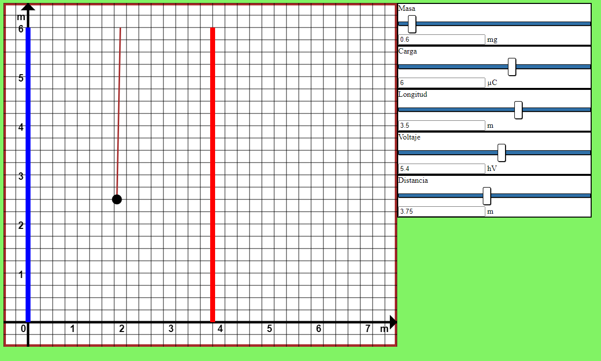

# Pendulo con una carga.
Esta es una página web, donde se quiso mostrar el funcionamiento de placas con condesadores y como estas afecta a una carga sujeta a una cuerda, esto con el fin de poder viarias todos los parametros que influyen en este entorno, simulando así un pendulo con una carga.  
[Pendulo con una carga](https://royerlopezflores.github.io/pendulo-carga/)

